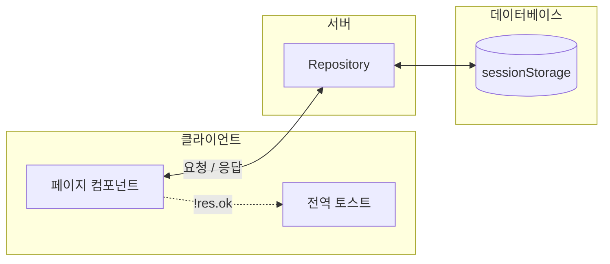

# 디렉토리 구조 & 데이터 흐름

Oct 7, 2026 · @DevYoung

코드가 어떤 폴더로 나뉘고, 데이터가 어떤 순서로 오가는지만 다룬다. 기술 선택은 [tech-stack.md](./tech-stack.md), 레포지토리 함수 계약은 [docs/common/repository/](../repository/)를 따른다.

## 목차

- [디렉토리 구조](#디렉토리-구조)
- [데이터 흐름](#데이터-흐름)

## 디렉토리 구조

```
src/
  main.tsx                  # 엔트리, React Router 부트스트랩
  App.tsx                   # 라우트 테이블 + 전역 레이아웃 마운트

  pages/                    # UI 라우트
    {topic}/
      {placeholder}.tsx
      index.ts
    index.ts

  layout/
    GlobalLayout.tsx          # 헤더(wallet-cash) + 전역 토스트 레이어, 세 라우트가 공유(components.md "전역 요소 중복 금지")

  components/
    ui/                       # shadcn CLI 설치 산출물(button.tsx, input.tsx, ...)
    CartItem/                 # ui/ 부품을 조합한 재사용 컴포넌트, 컴포넌트당 폴더 하나(components.md)
      CartItem.tsx
      index.ts
    ...

  context/                   # 전역 상태(React Context)
    common/                     # 여러 topic이 같이 쓰는 공통 모듈(예: Context 생성 헬퍼, 공통 타입)
      {placeholder}.ts
      index.ts
    {topic}/
      {placeholder}Context.tsx
      index.ts
    index.ts

  repository/
    Repository.ts             # class Repository
    index.ts

  types/
    {topic}/
      {placeholder}.ts
      index.ts
    index.ts

  constants/
    {topic}/
      {placeholder}.ts
      index.ts
    index.ts

  utils/
    {topic}/
      {placeholder}.ts          # 도메인 타입 몰라도 동작하는 범용 변환/포맷 순수함수
      index.ts
    index.ts

  lib/
    {topic}/
      {placeholder}.ts
      index.ts
    index.ts
```

### 폴더 네이밍 규칙

- `{topic}`/`{placeholder}`는 실제 작성 시 치환되는 자리표시자다. `{topic}`은 폴더명(주제), `{placeholder}`는 그 폴더 안 구현 파일명
- pages/context/types/constants/utils/lib 공통 규칙: 주제당 폴더 하나, 폴더 안엔 구현 파일 + `index.ts`(barrel)
- barrel은 2단이다 — 안쪽 `{topic}/index.ts`는 그 폴더 안 파일들을 모으고, 디렉토리 최상위 `index.ts`는 전체를 다시 재노출한다. 안쪽이 있어서 토픽 폴더 내부 파일 구성이 바뀌어도 최상위는 안 바뀐다


## 데이터 흐름


