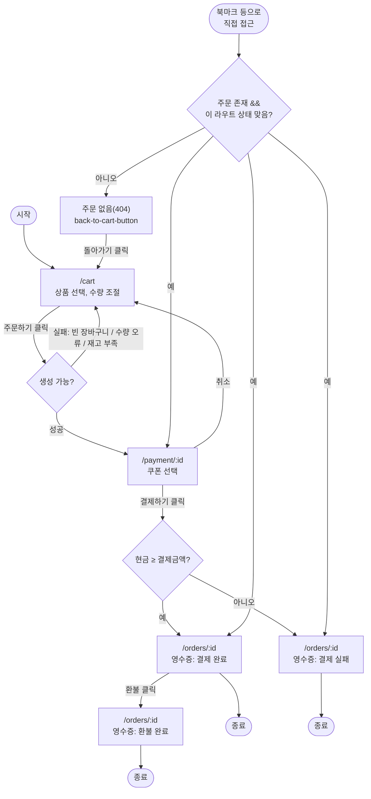

# 사용자 플로우

Oct 6, 2026 · @DevYoung

화면과 사용자 행동, 분기만 다룬다. 레포지토리 호출 상세는 [docs/common/repository/](../repository/), 화면 배치는 [wireframe.md](./wireframe.md)를 따른다.

## 플로우

## 분기 이유

| 분기 | 이유 |
| --- | --- |
| 생성 실패 시 `/cart`에 머무름 | 주문이 안 생겼으니 이동할 다음 화면이 없음 |
| 취소 시 `/cart`로 돌아감(영수증 없음) | 결제 시도 자체가 없었던 거라 보여줄 이력이 없음 |
| 결제 실패도 `/orders/:id`로 이동(영수증 있음) | 결제를 "시도"한 이력이라 실패 이유와 함께 남김 |
| 직접 접근 시 가드 실패하면 자동 리다이렉트 대신 404 화면 | sessionStorage는 탭 닫으면 사라져서 북마크 재진입 시 주문이 없을 수 있음. 가드 규칙은 architecture/tech-stack.md |
